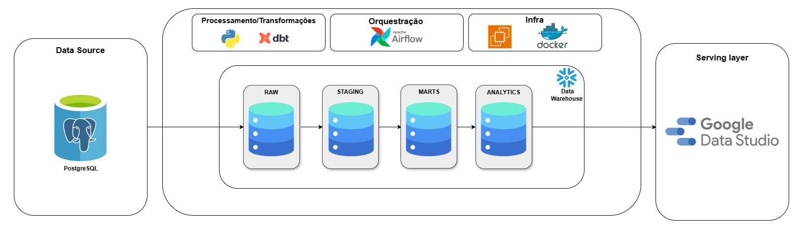
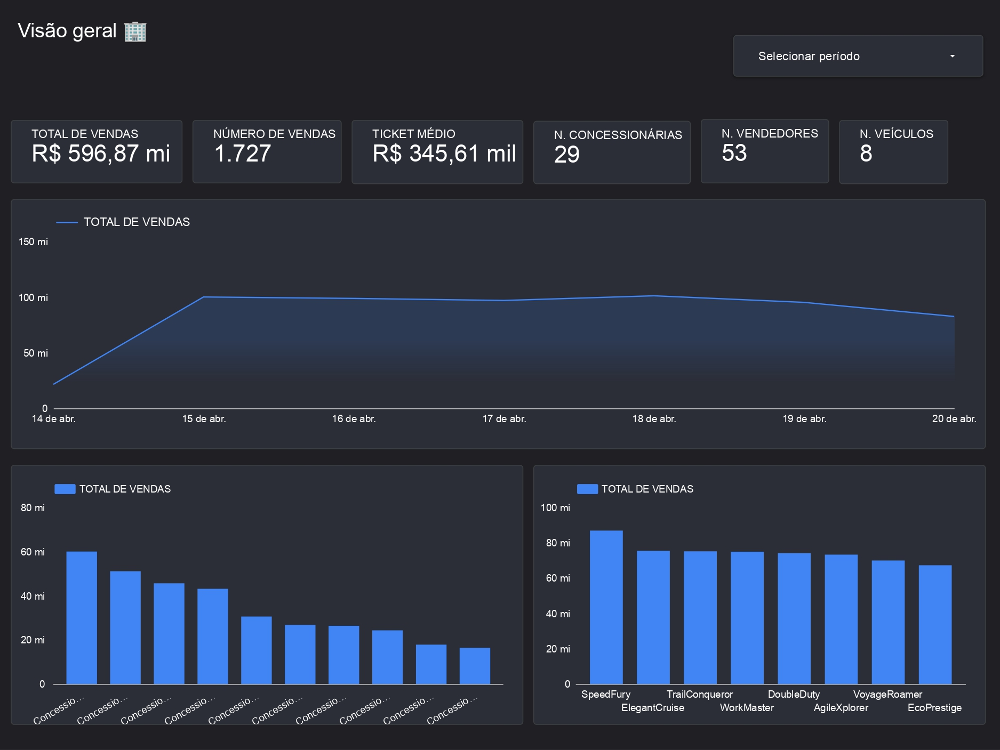
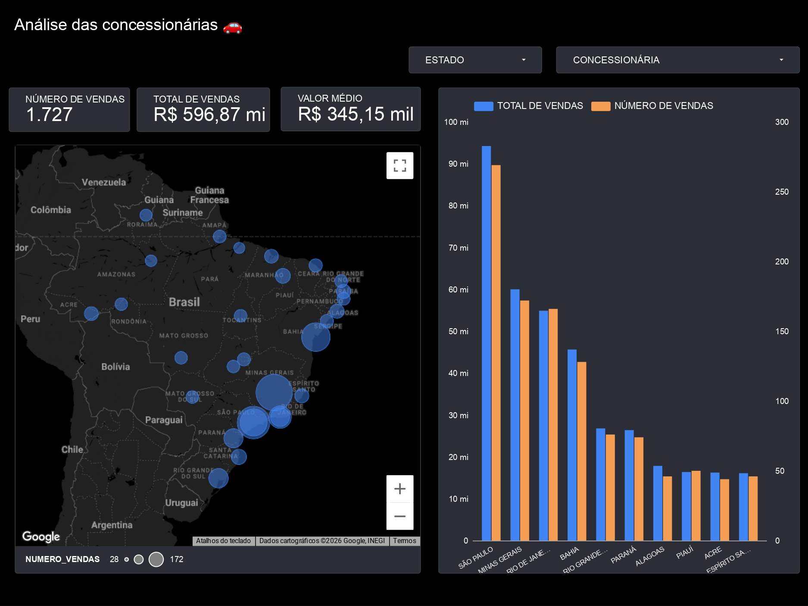
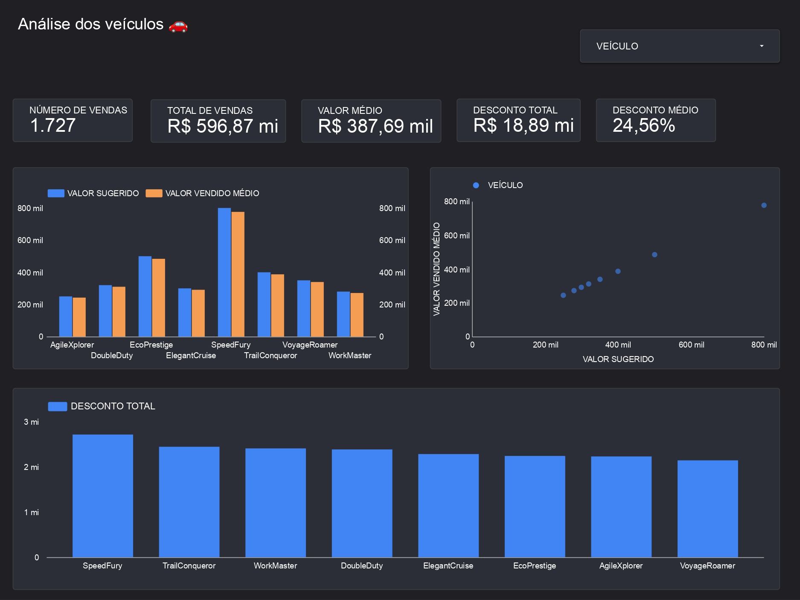
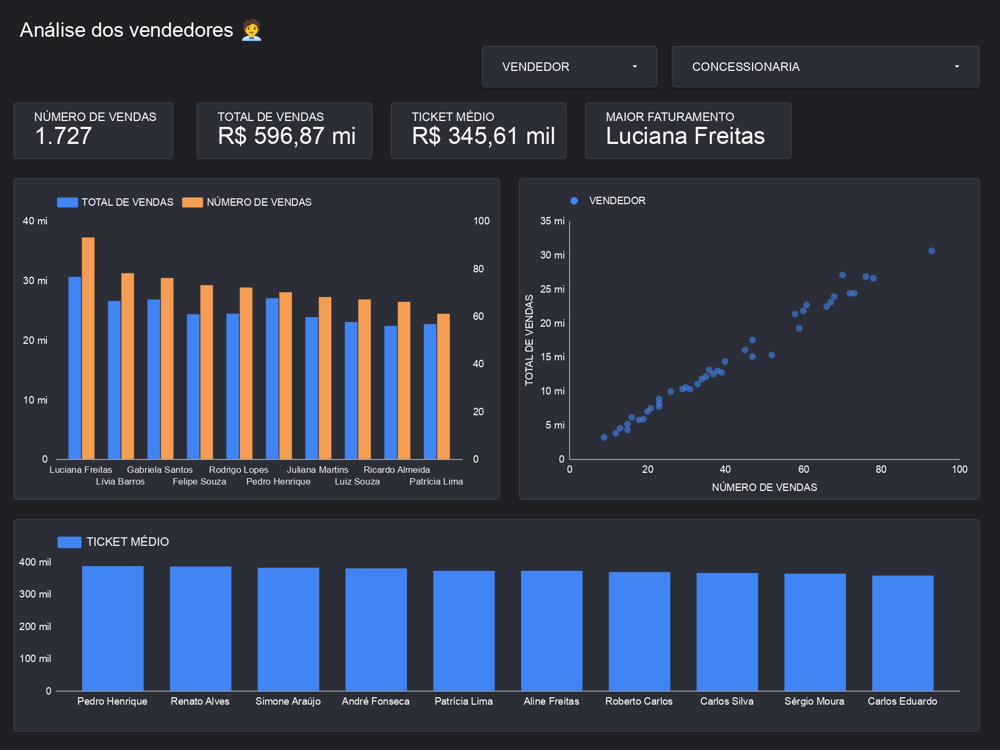
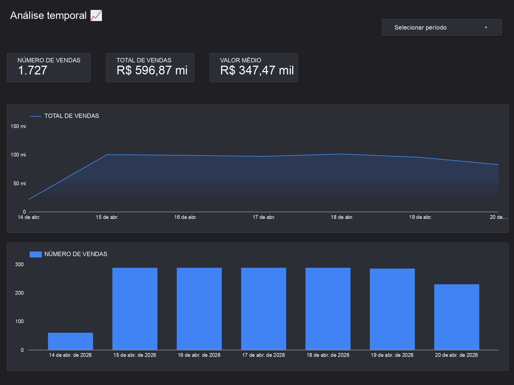
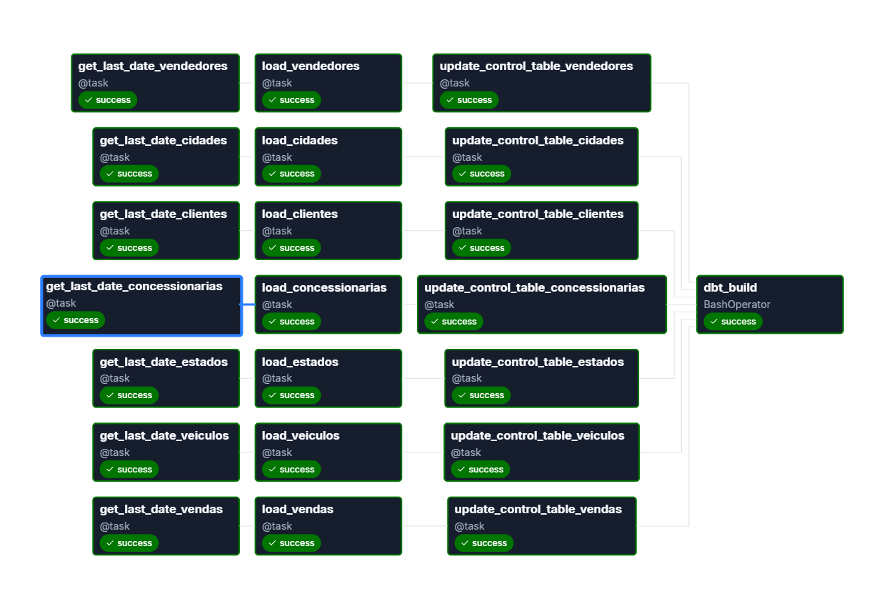
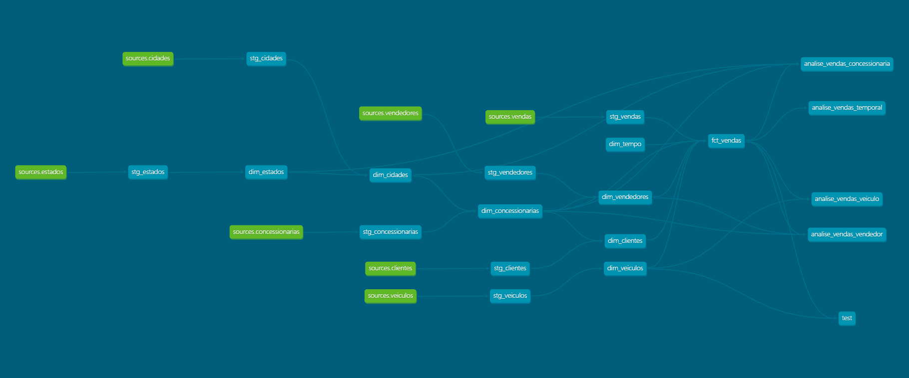

# Pipeline ELT em Batch

**Pipeline ELT orquestrado, com modelagem dimensional e entrega analítica ponta a ponta.**

#### Projeto de Engenharia de Dados com pipeline ELT em batch incremental para análise de vendas de uma empresa de automóveis, processando dados do PostgreSQL para Snowflake e disponibilizando dashboards analíticos no Google Data Studio.

**Resultados:**
- Análise de vendas por concessionária, veículo e vendedor
- Visão temporal das vendas
- Pipeline automatizado com Airflow

---

## Resumo
- **Tipo de pipeline:** Batch incremental (ELT)
- **Orquestração:** Airflow
- **Data Warehouse:** Snowflake
- **Transformação:** dbt
- **Fonte:** PostgreSQL
- **Consumo:** Google Data Studio

---

## Sobre o Projeto

O gestor da empresa precisa de uma visão melhor das vendas para apoiar a tomada de decisão do negócio. Alguns dos pedidos foram:

- vendas por concessionária
- vendas por veículo
- vendas por vendedor 
- análise temporal

Este projeto demonstra:
- Construção de pipeline ELT ponta a ponta
- Modelagem dimensional (Snowflake Schema - dimensões normalizadas)
- Orquestração de workflows com Airflow
- Transformações modulares com dbt

**Objetivo**: Desenvolver um pipeline ELT para ingestão, transformação e modelagem dimensional de dados de vendas, disponibilizando-os em um Data Warehouse para análise e suporte à tomada de decisão.

---

## Arquitetura do Pipeline



Fluxo de dados:

PostgreSQL → Python → Snowflake → dbt → Data Studio

Etapas:

1. Extração incremental dos dados baseada em controle de ingestão
2. Carga no Data Warehouse
3. Transformação e modelagem com dbt
4. Disponibilização para análise

---

## Dashboard

### Visão geral



### Análise das concessionárias



### Análise dos veículos



### Análise dos vendedores



### Análise temporal




> Observação: a base de dados possuía dados referentes a alguns dias de abril de 2026 (amostra limitada).

---

## Stack Tecnológica

| Camada            | Tecnologia        | Uso no Projeto |
|------------------|------------------|----------------|
| Fonte de Dados   | PostgreSQL       | Base transacional de vendas |
| Ingestão         | Python           | Extração e carga dos dados |
| Orquestração     | Airflow          | Agendamento e controle do pipeline |
| Data Warehouse   | Snowflake        | Armazenamento analítico |
| Transformação    | dbt              | Modelagem e transformação dos dados |
| Visualização     | Google Data Studio | Criação de dashboards |
| Infraestrutura   | Docker           | Containerização do ambiente |
| Infraestrutura   | AWS EC2          | Execução do Airflow |

---

## DAGs

### Airflow



### dbt



---

## Estrutura do Projeto

``` Text
.
├── dags/
│   └── postgres_to_snowflake.py
├── dbt/
│   ├── analyses/
│   ├── dbt_packages/
│   ├── logs/
│   ├── macros/
│   │   └── generate_schema_name.sql
│   ├── models/
│   │   ├── analysis/
│   │   │   ├── analise_vendas_concessionaria.sql
│   │   │   ├── analise_vendas_temporal.sql
│   │   │   ├── analise_vendas_veiculo.sql
│   │   │   └── analise_vendas_vendedor.sql
│   │   ├── dimensions/
│   │   │   ├── dim_cidades.sql
│   │   │   ├── dim_clientes.sql
│   │   │   ├── dim_concessionarias.sql
│   │   │   ├── dim_estados.sql
│   │   │   ├── dim_tempo.sql
│   │   │   ├── dim_veiculos.sql
│   │   │   └── dim_vendedores.sql
│   │   ├── facts/
│   │   │   └── fct_vendas.sql
│   │   ├── staging/
│   │   │   ├── stg_cidades.sql
│   │   │   ├── stg_clientes.sql
│   │   │   ├── stg_concessionarias.sql
│   │   │   ├── stg_estados.sql
│   │   │   ├── stg_veiculos.sql
│   │   │   ├── stg_vendas.sql
│   │   │   └── stg_vendedores.sql
│   │   └── source.yml
│   ├── seeds/
│   ├── snapshots/
│   ├── target/
│   ├── tests/
│   │   └── test.sql
│   ├── dbt_project.yml
│   ├── package-lock.yml
│   ├── packages.yml
│   └── profiles.yml.example
├── docs/
│   ├── architecture/
│   │   ├── airflow/
│   │   ├── dbt/
│   │   └── modelagem/
│   │       └── operacional/
│   └── dashboards/
├── infra/
│   ├── bootstrap.sh
│   ├── setup_airflow.sh
│   └── setup_project.sh
├── sql/
│   ├── config/
│   │   └── snowflake_roles.sql
│   └── ddl/
│       └── create_table.sql
├── src/
│   ├── common/
│   │   └── decorators.py
│   ├── control/
│   │   └── ingestion_control.py
│   └── ingestion/
│       ├── extract/
│       │   └── postgres_extractor.py
│       └── loaders/
│           └── snowflake_load.py
├── .gitignore
├── Dockerfile
├── README.md
└── requirements.txt
```

---

## Como Executar

### Pré-requisitos
- Docker
- Conta no Snowflake

### Passos

1. Clone o repositório:

```bash
git clone https://github.com/gustavocljesus/airflow-dbt-snowflake-elt-pipeline.git
cd airflow-dbt-snowflake-elt-pipeline
```

2. Configure as credenciais do Snowflake no arquivo `profiles.yml`

3. Execute o script de bootstrap para preparar o ambiente:

```bash
cd infra
chmod +x bootstrap.sh
./bootstrap.sh
```

4. 4. Acesse o Airflow em `http://localhost:8080` e execute a DAG

---

## Próximos passos

- [ ] Implementar testes de qualidade no dbt (`not null`, `unique`, `relationships`)
- [ ] Melhorar a portabilidade do ambiente com Docker Compose
- [ ] Garantir idempotência na ingestão incremental
- [ ] Substituir a fonte mockada por uma API
- [ ] Migrar do Google Data Studio para Power BI